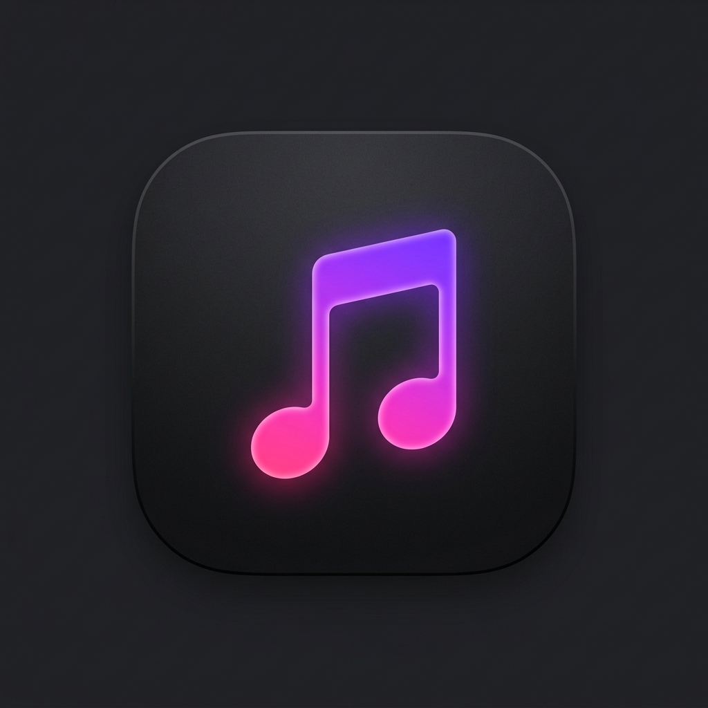

<p align="center">
  
</p>

<h1 align="center">Neotune</h1>

<p align="center">
  A premium, modern music streaming client designed for Android, backed by an automated FastAPI server. Built with a sleek Material 3 layout, Neotune replicates the buttery-smooth, gestural, and atmospheric aesthetics of premium modern streaming platforms.
</p>

<p align="center">
  <a href="https://developer.android.com/"></a>
  <a href="https://kotlinlang.org/"></a>
  <a href="https://fastapi.tiangolo.com/"></a>
</p>

---

## ✨ Features Showcase

### 🆓 Completely Free & No Account Needed
* **Zero Subscriptions or Ads**: Enjoy unlimited music without paywalls or interruptive advertisements.
* **Instant Playback**: No sign-ups, no login sheets, and no accounts required. Just open the app and start listening to your favorite tracks!

### 🎨 Stunning Modern Themes
* **Dynamic Ambient Glow**: The player background extracts colors from the active album art in real-time, creating a gorgeous atmospheric gradient that smoothly cross-fades as you skip tracks.
* **Pitch-Black AMOLED Mode**: A custom, energy-saving deep black theme tailored for OLED displays.
* **Vibrant Accent Presets**: Customize the UI instantly with 5 gorgeous preset accent colors (Purple, Green, Blue, Pink, Orange) that dynamically recolor buttons, tabs, and playback sliders.

### 📥 Full Offline Downloading Support
* **Offline Audio Caching**: Save individual songs or entire playlists directly to your phone for offline playback with zero buffering.
* **Custom Storage Limits**: Control how much space Neotune uses. Choose limits from 500 MB to 5.0 GB (or Unlimited), and Neotune will automatically manage and evict the oldest cached songs to stay under your selected limit.
* **Local Playback Badges**: Easily identify downloaded tracks in standard listings with real-time download progress spinners and green cached checkmarks.

### 🎛️ Premium Gestural Controls
* **Interactive Mini-Player**: Swipe left or right on the floating mini-player card to instantly skip or play previous tracks. Features realistic spring physics animations and satisfying haptic vibration feedback.
* **Playlist Reordering**: Rearrange tracks inside your custom playlists dynamically via touch-and-drag reorder handles.

---

## 🚀 Features Coming Soon (Roadmap)

We are constantly working to make Neotune even better! Here is what's coming in the next updates:
* 🎤 **Real-Time Synchronized Lyrics** — Sing along with scrolling lyrics support.
* 🎛️ **Advanced Audio Equalizer** — Customize your audio profiles and bass-boost presets.
* 🚗 **Android Auto Support** — Bring the Neotune premium gestural player safely to your car dashboard.
* 💾 **Playlist Backups** — Export and import library backups easily.

---

## 📂 Project Architecture

```
Neotune/
├── app/                  # Jetpack Compose Android Application (Kotlin)
└── backend/              # Unified FastAPI API Server (Python 3)
```

---

## 🚀 Quick Start Guide

### 1. Launch the API Server
Ensure you have Python 3.8+ installed. You can launch the server using either of these simple methods:

* **Method A (Lightweight Release - Recommended)**:
  1. Head over to the **[Releases](../../releases)** page and download the lightweight **`Neotune-Server.zip`** package.
  2. Extract the zip file on your computer.
  3. Navigate to the extracted folder in your terminal, and install the requirements & run:
     ```bash
     pip install -r requirements.txt
     python run.py
     ```
* **Method B (Cloned Git Source)**:
  1. Clone this repository and navigate to the `backend/` directory in your terminal.
  2. Install requirements & run:
     ```bash
     pip install -r requirements.txt
     python run.py
     ```

The unified launcher will automatically discover your computer's local IP address, update the `yt-dlp` extraction binaries, check for zombie port conflicts on port `8000`, and boot up the FastAPI server.

### 2. Install & Connect the Android App
No need to deal with code compilation or Android Studio!

1. Head over to the **[Releases](../../releases)** page of this repository.
2. Download the latest compiled **`Neotune.apk`** file and install it directly on your Android phone.
3. **Connect to your Server**: Open the Neotune App on your phone -> Navigate to **Settings** -> tap **Connection** -> enter the local IP address displayed by the backend terminal launcher (e.g., `http://192.168.1.15:8000`) and tap **Check Connection** to run diagnostics and instantly connect!

---

## 🛠️ Built With

* **Android Client**: Jetpack Compose, Media3 & ExoPlayer, Coil, Kotlin Serialization.
* **API Backend**: FastAPI, yt-dlp, ytmusicapi.
